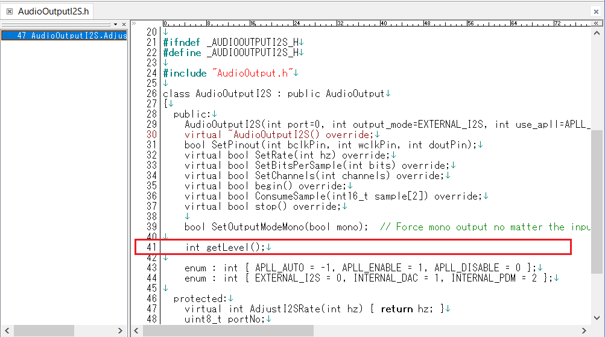
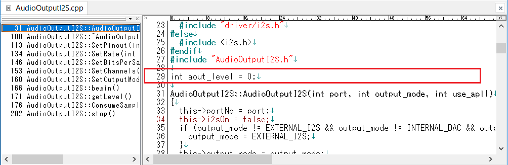
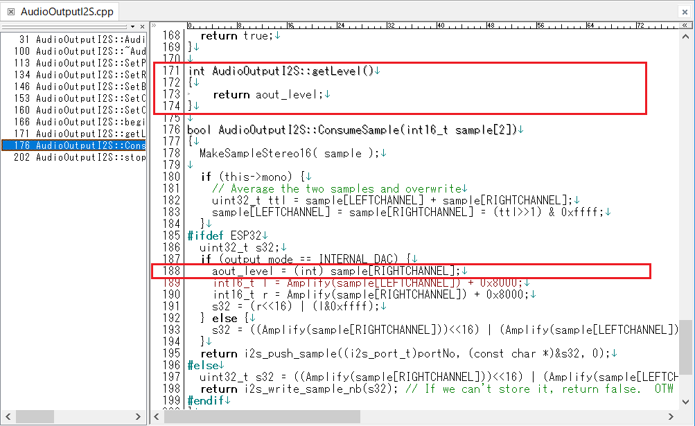

# M5Stack_PlayMP3_Avatar_Test
M5Stackでmp3ファイル再生とAvator表示のテスト

mp3ファイル再生は、M5Stack Libraryのexample"PlayMP3FromSDToDAC"をベースにさせていただきました。  
Avator表示は、meganetaaanさんのm5stack-avatorをベースにさせていただきました。 
オリジナルはこちら。 
An M5Stack library for rendering avatar faces <https://github.com/meganetaaan/m5stack-avator> 

---
### 必要な物 ###
* [M5Stack](http://www.m5stack.com/ "Title") (Grayで動作確認をしました。) 
* Arduino IDE (1.8.5で動作確認をしました。) 
* [Arduino core for the ESP32](https://github.com/espressif/arduino-esp32 "Title")
* [M5Stack Library](https://github.com/m5stack/M5Stack.git "Title")
* [ESP8266Audio](https://github.com/earlephilhower/ESP8266Audio/ "Title")  

### ESP8266Audioライブラリの修正 ###
"AudioOutputI2S.h"に下図赤枠部分を追加します。
  
"AudioOutputI2S.cpp"に下図赤枠部分を追加します。
 
   

### 操作方法 ###
1. SDカードに"test.mp3"というファイル名で、mp3ファイルを入れておきます。
2. M5StackのAボタンで再生開始します。
3. M5StackのBボタンで再生停止します。
   
